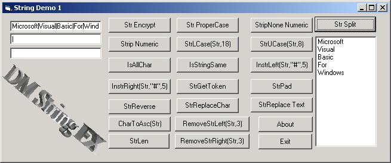



## DM Strings FX

### Description

Hi this is a little String Manipulation project I made To help beginners understand strings and people at other levels I have included all examples of each function to make it easyer. Sorry I have not included many comments if any but I was bussy at the times working on another project anyway I hope you get some Ideas from it. please vote if you like this code and level comments.
 
### More Info
 

             |
---                |---
**Submitted On**   |2002-06-04 11:00:32
**By**             |[dreamvb](https://github.com/Planet-Source-Code/PSCIndex/blob/master/ByAuthor/dreamvb.md)
**Level**          |Beginner
**User Rating**    |4.7 (28 globes from 6 users)
**Compatibility**  |VB 6\.0
**Category**       |[String Manipulation](https://github.com/Planet-Source-Code/PSCIndex/blob/master/ByCategory/string-manipulation__1-5.md)
**World**          |[Visual Basic](https://github.com/Planet-Source-Code/PSCIndex/blob/master/ByWorld/visual-basic.md)
**Archive File**   |[DM Strings21990712001\.zip](https://github.com/Planet-Source-Code/dreamvb-dm-strings-fx__1-24610/archive/master.zip)

